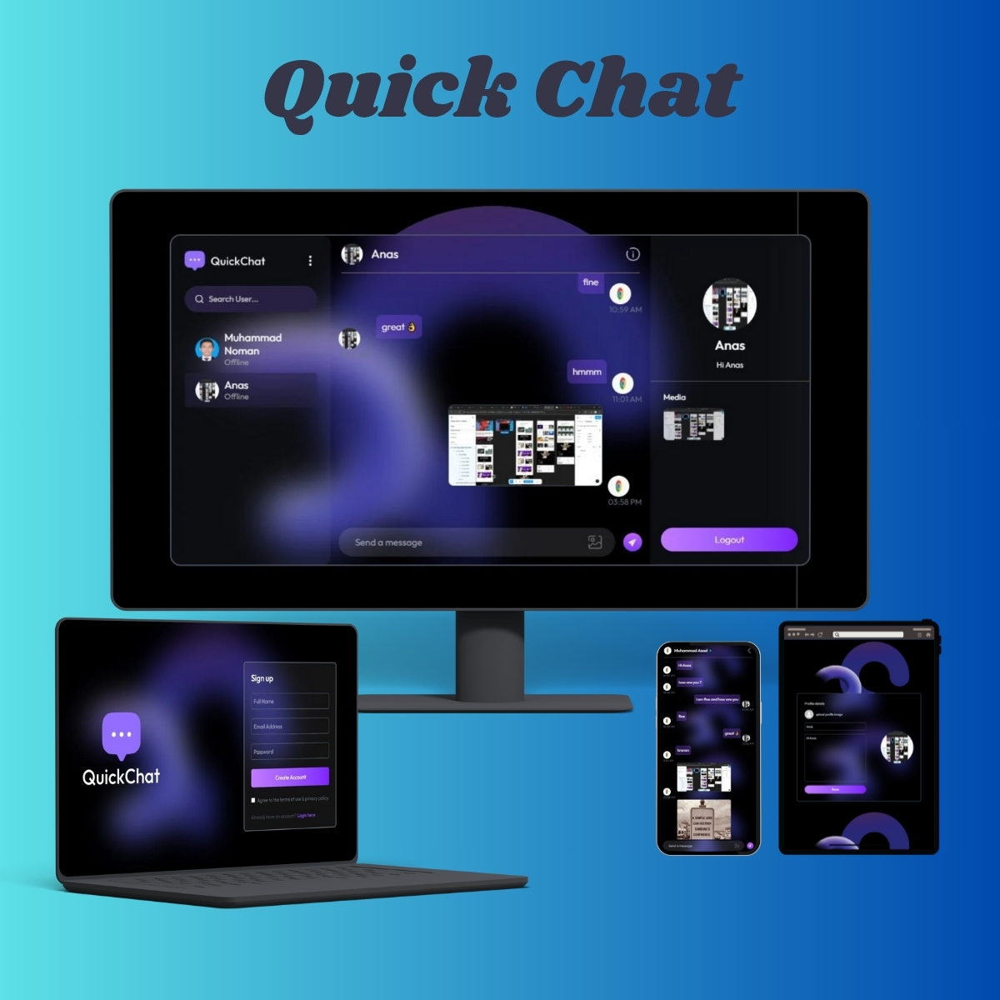

# Quick Chat

Live demo: [https://quick-chat.vercel.app](https://quick-chat.vercel.app)



## Description

Quick Chat is a simple, lightweight chat application built with a client and server architecture. It provides the basics for real-time messaging and is suitable as a starter project or for learning how to connect a frontend app to a backend chat server.

---

## Features

* Real-time messaging (client ↔ server)
* User-friendly chat UI
* Modular client and server folders for easy development
* Ready for local development and deployment

---

## Tech stack

* JavaScript
* (Client) React / Vite / Create React App — check `client/package.json` for exact details
* (Server) Node.js / Express — check `server/package.json` for exact details
* (Optional) WebSockets (Socket.IO) or other real-time library — check server implementation

---

## Repository structure

```
/ (root)
├─ client/        # Frontend application
├─ server/        # Backend API / real-time server
├─ .gitignore
└─ README.md
```

---

## Quick start (local)

> Run these commands from the repository root. If your project uses different scripts, replace them with the ones in your `package.json` files.

1. Clone the repo

```bash
git clone https://github.com/Muhammadnoman004/quick-chat.git
cd quick-chat
```

2. Install and start the server

```bash
cd server
npm install
# if you use nodemon for development
npm run dev
# or
node index.js
```

3. Install and start the client (in a new terminal)

```bash
cd ../client
npm install
npm run dev
# or
npm start
```

4. Open the app

* Client: [http://localhost:3000](http://localhost:3000) (or the port printed by the client)
* Server: [http://localhost:5000](http://localhost:5000) (or the port printed by the server)

---

## Environment variables

Create a `.env` file in the `server` (and `client` if needed) with the following placeholders:

```
# server/.env
PORT=5000
JWT_SECRET=your_jwt_secret_here
MONGODB_URI=your_mongodb_connection_string_here
# any other keys your project requires (e.g. CLOUDINARY_URL, API keys)
```

Replace these with the actual variables your project uses. Check `server/config` or the top of `server.js` for exact names.

---

## Deployment

* Client can be deployed to Vercel, Netlify, or any static host
* Server can be deployed to services like Heroku, Render, Railway, or a VPS

If you use Vercel for the client and a separate platform for the server, remember to set the production server URL in the client environment (e.g. `REACT_APP_API_URL`).

---

## Contact

Muhammad Noman — [https://github.com/Muhammadnoman004](https://github.com/Muhammadnoman004)